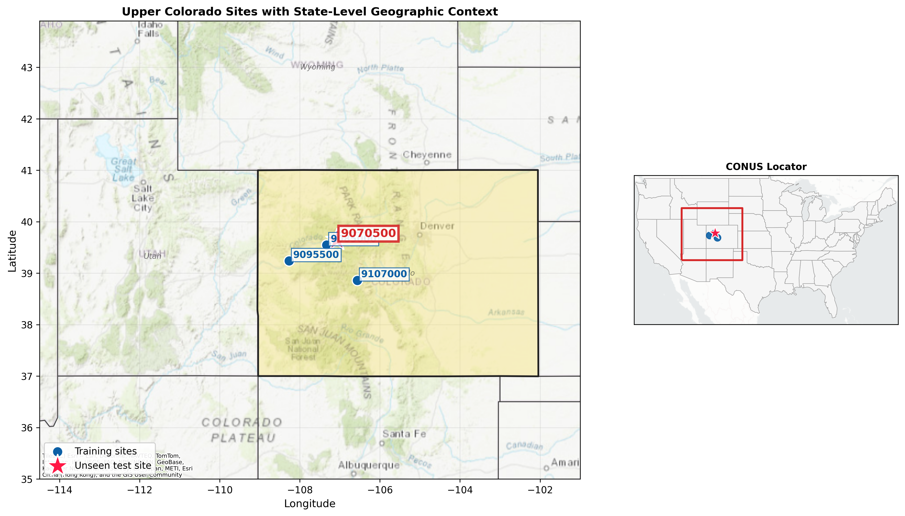

# Streamflow Prediction with LSTM (Upper Colorado Basin)

This repository contains my CVEEN 6920 Assignment 3 project for daily streamflow prediction using a Long Short-Term Memory (LSTM) model. The analysis combines USGS streamflow records with Daymet meteorological forcings and static site descriptors to build a regional model that is trained on multiple gauges and tested on an unseen gauge.

The workflow is designed to be reproducible end-to-end. Running the scripts in order downloads source data, prepares features, trains/evaluates the model, and generates the figures and summary outputs used in the report. Generated data and artifacts are intentionally excluded from version control, so the repository stays lightweight and focused on code, configuration, and documentation.

For a single-file submission-ready version of the project, use `streamflow_lstm_upper_colorado_workflow.ipynb`, which consolidates the full workflow into one Jupyter notebook.

GitHub repository link (for report):
- https://github.com/ryanlent3003/HI3

## Project Figure


Figure: Study-site geographic context map used in the streamflow LSTM analysis.

## What Each Script Does
- `01_data_acquisition_processing.py`: downloads/rebuilds site-level datasets and writes processed tables.
- `02_train_evaluate_lstm.py`: runs model training, validation, testing, and writes metrics/predictions/plots.
- `03_figures_analysis.py`: creates a compact analysis summary from model outputs.

## Notebook Version
- `streamflow_lstm_upper_colorado_workflow.ipynb`: self-contained notebook version of the full assignment workflow.

## Environment Setup
You can use either `pip` or `conda`.

### Option A: pip
```bash
python -m venv .venv
source .venv/bin/activate
pip install --upgrade pip
pip install -r requirements.txt
```

### Option B: conda
```bash
conda env create -f environment.yml
conda activate cven6920-assignment3
```

## Run Order
From the repository root:

```bash
python 01_data_acquisition_processing.py
python 02_train_evaluate_lstm.py
python 03_figures_analysis.py
```

The scripts are non-interactive and create required folders automatically.

To run the notebook version instead, open `streamflow_lstm_upper_colorado_workflow.ipynb` and execute the cells from top to bottom.

## Reproducibility Notes
- No raw/processed data or generated outputs are committed to Git.
- Data are retrieved programmatically (USGS NWIS + Daymet), so internet access is required for data download.
- The `.gitignore` keeps generated artifacts out of source control.
